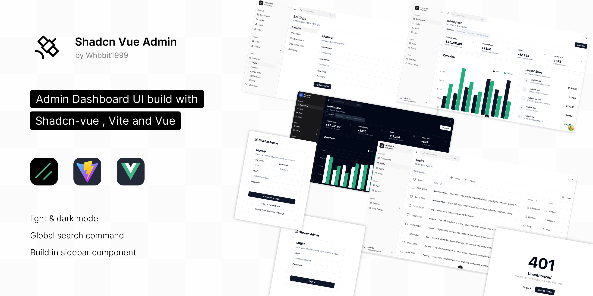

# Shadcn Vue Admin

[](https://github.com/antfu/eslint-config)
[](https://github.com/Whbbit1999/shadcn-vue-admin/blob/main/LICENSE)
[](https://vuejs.org/)
[](https://vitejs.dev/)
[](https://pnpm.io/)
[](https://www.typescriptlang.org/)

[English](./README.md) | 简体中文

基于 **Shadcn-vue**、**Vue 3.5+** 和 **Vite 7+** 构建的企业级管理仪表板 UI，专注于响应式设计、可访问性与开发者体验。
本项目 Fork 自 [shadcn-admin](https://github.com/satnaing/shadcn-admin)



> ⚠️ 版本说明：当前稳定版本 `0.11.0` | 本项目为可直接使用的起始模板，后续将持续新增组件与功能。

## ✨ 核心特性

- ✅ 亮/暗色模式切换，支持 Pinia 持久化存储
- ✅ 全局搜索命令面板
- ✅ 符合可访问性标准的 shadcn-ui 侧边栏导航
- ✅ 8+ 个预构建的功能页面
- ✅ 基于 shadcn-vue 扩展的自定义组件库
- ✅ 基于文件结构的自动路由生成系统
- ✅ 国际化支持（vue-i18n v11+）
- ✅ VeeValidate + Zod 表单验证
- ✅ TanStack Table/Query & Unovis 数据可视化
- ✅ 流畅动画支持（AutoAnimate、Motion-V、TW Animate CSS）

## 🛠️ 技术栈与版本约束

| 分类             | 工具与库（主版本号）                                                                                                                                       |
| ---------------- | ---------------------------------------------------------------------------------------------------------------------------------------------------------- |
| 核心框架         | [Vue 3.5+](https://vuejs.org/), [TypeScript 5.9+](https://www.typescriptlang.org/)                                                                         |
| UI 组件          | [shadcn-vue](https://www.shadcn-vue.com), [reka-ui 2+](https://www.reka-ui.com/), [lucide-vue-next 0+](https://lucide.dev/)                                |
| 构建工具         | [Vite 7+](https://vitejs.dev/), [@vitejs/plugin-vue 6+](https://github.com/vitejs/vite-plugin-vue)                                                         |
| 状态管理         | [Pinia 3+](https://pinia.vuejs.org/), [pinia-plugin-persistedstate 4+](https://prazdevs.github.io/pinia-plugin-persistedstate/)                            |
| 路由管理         | [vue-router 5+](https://router.vuejs.org/), [vite-plugin-vue-layouts 0.11+](https://github.com/JohnCampionJr/vite-plugin-vue-layouts)                      |
| 样式系统         | [Tailwind CSS 4+](https://tailwindcss.com/), [tailwindcss-animate 1+](https://github.com/jamiebuilds/tailwindcss-animate)                                  |
| 数据处理         | [TanStack Vue Query 5+](https://tanstack.com/query/latest), [TanStack Vue Table 8+](https://tanstack.com/table/latest)                                     |
| 表单验证         | [VeeValidate 4+](https://vee-validate.logaretm.com/), [Zod 4+](https://zod.dev/)                                                                           |
| 动画效果         | [@formkit/auto-animate 0.9+](https://auto-animate.formkit.com/), [motion-v 1+](https://motion-v.vercel.app/)                                               |
| 国际化           | [vue-i18n 11+](https://vue-i18n.intlify.dev/)                                                                                                              |
| HTTP 客户端      | [axios 1+](https://axios-http.com/)                                                                                                                        |
| 代码规范与格式化 | [ESLint 9+](https://eslint.org/), [@antfu/eslint-config 7+](https://github.com/antfu/eslint-config)                                                        |
| 开发工具         | [vite-plugin-vue-devtools 8+](https://github.com/webfansplz/vite-plugin-vue-devtools)                                                                      |
| 自动导入         | [unplugin-auto-import 20+](https://github.com/antfu/unplugin-auto-import), [unplugin-vue-components 30+](https://github.com/antfu/unplugin-vue-components) |

## 🚀 快速开始

### 前置依赖（严格版本要求）

- Node.js ≥ 20.x（推荐 LTS 版本）
- **pnpm 10+**（项目指定包管理器）
- TypeScript ≥ 5.9.0

### 安装步骤

1. 克隆仓库到本地

   ```bash
   git clone https://github.com/Whbbit1999/shadcn-vue-admin.git
   ```

2. 进入项目目录

   ```bash
   cd shadcn-vue-admin
   ```

3. 安装依赖

   ```bash
   pnpm install
   ```

4. 启动开发服务器
   ```bash
   pnpm dev
   ```

### 可用脚本

```bash
pnpm dev             # 启动开发服务器
pnpm build           # 生产构建（包含 TypeScript 类型检查）
pnpm preview         # 预览生产构建产物
pnpm lint            # 执行 ESLint 代码检查
pnpm lint:fix        # 自动修复代码规范问题
pnpm release         # 使用 bumpp 升级版本
```

## 📖 高级指南

### 依赖维护

- 所有项目依赖每周二更新，以确保安全性与兼容性。
- 关键依赖版本严格锁定，避免兼容性问题。
- 通过 `simple-git-hooks` + `lint-staged` 启用 Git 钩子（pre-commit），保障代码质量。

### 主题定制

如需自定义网站样式，可使用 [tweakcn](https://tweakcn.com/editor/theme) 提供的预设样式：

1. 从 tweakcn 复制生成的 CSS 变量
2. 将其粘贴到项目的 `index.css` 文件中
3. 修改 `:root`、`:dark` 和 `@theme inline` 部分即可应用自定义样式

### 布局定制（嵌套目录无 `index.vue` 场景）

如果希望 `pages/errors/` 和 `pages/auth/` 等目录下的页面不使用默认布局，可按以下步骤操作：

#### 步骤 1：创建目录级布局文件

在 `pages/` 目录下创建与子目录同名的文件，如 `src/pages/errors.vue` 和 `src/pages/auth.vue`，内容如下：

```vue
<template>
  <router-view />
</template>

<route lang="yml">
meta:
  layout: false # 禁用默认布局，适用于所有子路由
</route>
```

#### 步骤 2：解决冗余路由问题

上述操作会生成空的父路由（如 `/errors/`、`/auth/`），可通过以下方式修复：

1. 在目标目录中创建 `index.vue`（如 `pages/errors/index.vue`）
2. 在该文件中添加重定向逻辑（基于 Vue 3.5+ 组合式 API）：

```vue
<script lang="ts" setup>
import { useRouter } from 'vue-router'

const router = useRouter()
// 示例：重定向至 404 页面
router.replace({ name: '/errors/404' })
</script>
```

## 📄 许可证

本项目采用 **MIT 许可证**，详情请参阅 [LICENSE](https://github.com/Whbbit1999/shadcn-vue-admin/blob/main/LICENSE) 文件。

## 🤝 致谢

- **开发者**：[Whbbit1999](https://github.com/Whbbit1999)
- **原始设计**：[shadcn-admin](https://github.com/satnaing/shadcn-admin)
- **核心依赖**：shadcn-vue、Vue.js、Vite、Tailwind CSS
